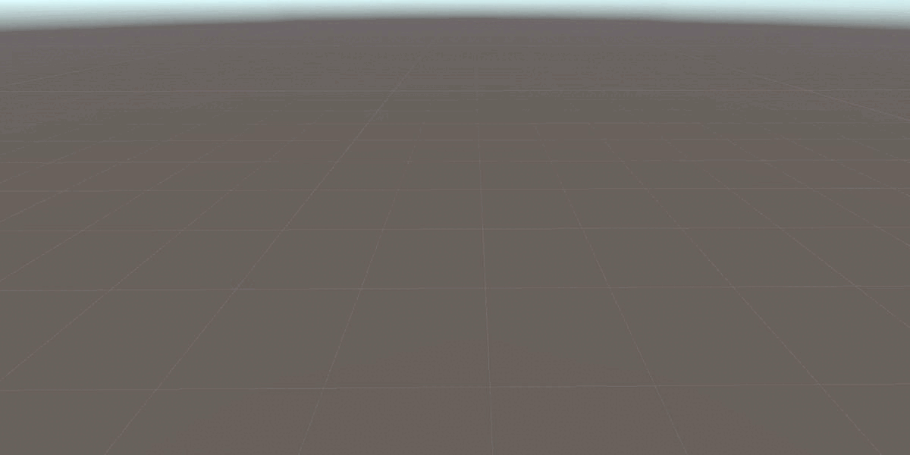
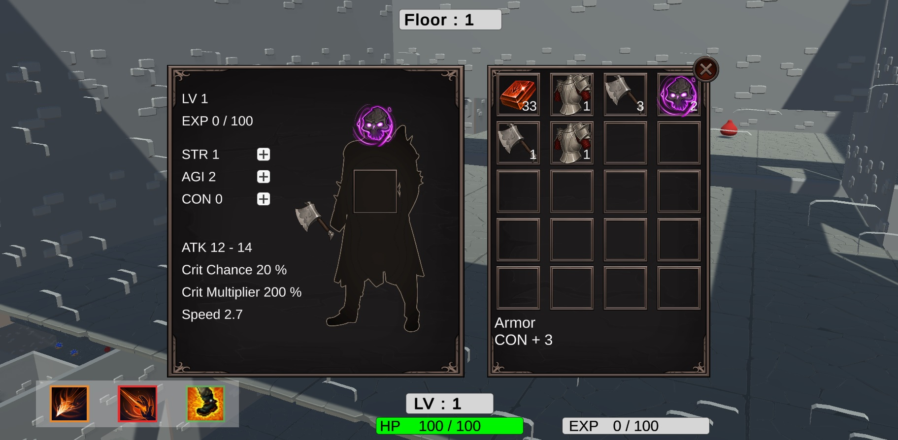

# Dungeon Knight Adventure
3D Roguelike 迷宮探索遊戲  

## 簡介

動態生成的3D迷宮關卡

打敗迷宮中的敵人，隨機取得道具和裝備，提升等級與能力值

打敗位於迷宮最底層的頭目，前往下一關

玩家角色可以使用近戰或遠程攻擊，並使用翻滾閃躲

## 迷宮動態生成
 
1. 在一定空間內產生一些大小不一的房間

2. 以Delaunay triangulation做出連接所有房間的Graph，然後產生Minimum Spanning Tree作為基本路線

3. 將一部分在MST生成中被剔除的冗餘Edge放回路線，使迷宮更複雜

4. 配合A*演算法，生成路線上的地板和階梯

## 能力值與裝備
 
STR 力量 : 影響攻擊力  

AGI 敏捷 : 影響移動速度、翻滾技能的冷卻時間  

CON 體質 : 影響最大生命值  

等級提升時獲得3個能力點數，可以自由分配  

裝備分為 頭盔 / 胸甲 / 武器 3種  

回血道具可回復50點生命值

## 操作
esc : 暫停

WASD : 移動  

空白鍵 : 跳躍  

滑鼠左鍵 : 近戰攻擊  

滑鼠右鍵 : 技能 - 火焰長矛  

shift + 滑鼠右鍵 : 技能 - 火焰噴射 

alt : 技能 - 翻滾閃避

##
[Demo Video](https://youtu.be/Dnx5DR5pg6o)

[Build](https://drive.google.com/file/d/1a9_40h4c44H7zcufbKbu9T_Cf03BoxWh/view?usp=drive_link/)
